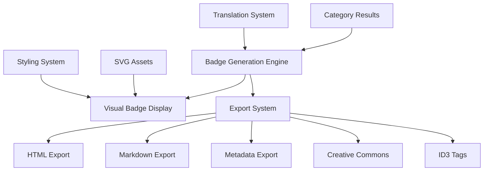
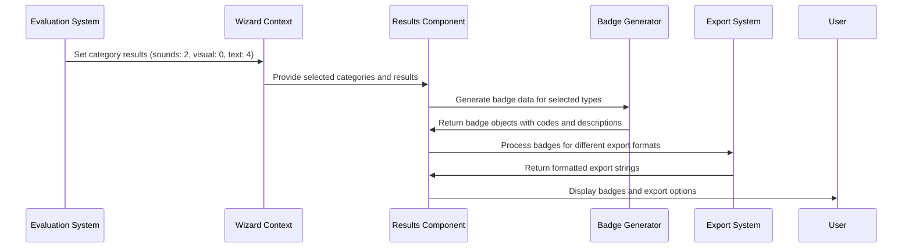

# Badge Generation and Export System

## Overview

The Badge AI system generates standardized visual badges and provides multiple export formats for communicating AI usage transparency in creative works. The system produces badges with notation like `S-AI-2`, `V-AI-0`, `T-AI-4` and exports them in various formats suitable for different platforms and use cases.

## Badge System Architecture



## Badge Notation System

### Standardized Format Structure

The badge system uses a consistent notation: **`{TYPE}-AI-{LEVEL}`**

**Type Identifiers:**
- **S**: Sounds (music, audio, spoken content, sound effects)
- **V**: Visual (images, videos, animations, graphics)  
- **T**: Text (written content, code, documentation)

**AI Usage Levels (0-4):**
- **0**: Human Only - Exclusively human-created without AI assistance
- **1**: Human with AI - Primarily human work with minor AI assistance
- **2**: AI Collaboration - Balanced human-AI collaboration
- **3**: Directed AI - AI generation with significant human direction
- **4**: AI Only - Fully AI-generated without human editing

### Badge Code Examples

```typescript
// Example badge notations
const badgeExamples = [
  "S-AI-0", // Human-only music composition
  "V-AI-2", // Collaborative visual design
  "T-AI-4", // Fully AI-generated text
  "S-AI-1", // Human music with AI mastering assistance
  "V-AI-3"  // AI-generated visuals with human direction
];
```

## Visual Badge Components

### SVG Asset System

Badge visual assets are stored in `/public/badges/category-[0-4].svg`:

**SVG Design Pattern:**
```xml
<!-- Example: category-0.svg (Human Only) -->
<svg viewBox="0 0 80 80" xmlns="http://www.w3.org/2000/svg">
  <!-- Base circle with dark background -->
  <circle cx="40" cy="40" r="38" fill="#1a1a1a" stroke="#fff" stroke-width="2"/>
  <circle cx="40" cy="40" r="30" fill="#2a2a2a" stroke="#fff" stroke-width="1"/>
  
  <!-- Human figure icon for category 0 -->
  <path d="M40 25c-3 0-5.5 2.5-5.5 5.5s2.5 5.5 5.5 5.5..." fill="#fff"/>
  
  <!-- Category number -->
  <text x="40" y="65" text-anchor="middle" fill="#fff" font-size="12">0</text>
</svg>
```

**Visual Progression Across Categories:**
- **Category 0**: Single human figure (full human control)
- **Category 1**: Human figure with small AI element  
- **Category 2**: Human and AI figures with connection
- **Category 3**: Small human, larger AI with direction arrow
- **Category 4**: Large AI figure with connected elements

### ResultBadge Component

The visual badge renderer with category-specific styling:

```typescript
// src/components/ResultBadge.tsx
interface ResultBadgeProps {
  category: Category;
  contentType: 'sounds' | 'visual' | 'text';
  title: string;
  description: string;
  badgeCode: string;
}

export default function ResultBadge({ category, contentType, title, description, badgeCode }: ResultBadgeProps) {
  // Category-specific gradient mapping
  const gradientClasses = {
    0: "from-blue-500 to-blue-600",    // Human Only - Blue
    1: "from-red-500 to-red-600",      // Human with AI - Red  
    2: "from-orange-500 to-orange-600", // Collaboration - Orange
    3: "from-yellow-500 to-yellow-600", // Directed AI - Yellow
    4: "from-green-500 to-green-600"   // AI Only - Green
  };

  // Category-specific icons
  const iconComponents = {
    0: <UserIcon className="w-5 h-5" />,           // Human
    1: <PlayIcon className="w-5 h-5" />,           // Assistance
    2: <PencilIcon className="w-5 h-5" />,         // Collaboration
    3: <UserGroupIcon className="w-5 h-5" />,      // Direction
    4: <FaceSmileIcon className="w-5 h-5" />       // AI Generation
  };

  return (
    <motion.div
      className={`
        relative p-4 rounded-xl border bg-gradient-to-br ${gradientClasses[category]}
        shadow-lg hover:shadow-xl transition-all duration-300
      `}
      whileHover={{ scale: 1.02, y: -2 }}
      whileTap={{ scale: 0.98 }}
    >
      {/* Badge SVG Display */}
      <div className="flex items-center space-x-4 mb-3">
        <div className="w-12 h-12 relative">
          <Image
            src={`/badges/category-${category}.svg`}
            alt={`Category ${category} badge`}
            fill
            className="object-contain"
          />
        </div>
        <div className="flex-1">
          <h3 className="font-semibold text-white">{title}</h3>
          <p className="text-white/80 text-sm">{description}</p>
        </div>
        {iconComponents[category]}
      </div>
      
      {/* Badge Code Display */}
      <div className="bg-black/20 rounded-lg p-2 text-center">
        <span className="font-mono font-bold text-white">{badgeCode}</span>
      </div>
    </motion.div>
  );
}
```

## Export System Architecture

### Export Format Generation

The results component provides comprehensive export functionality:

```typescript
// src/steps/Result.tsx - Export generation methods
const generateBadgeHtml = (): string => {
  return `<div style="display: inline-flex; gap: 8px; font-family: sans-serif;">
  ${selectedBadges.map(badge => 
    `<span style="
      background-color: #dbeafe; 
      color: #1e40af; 
      border: 1px solid #93c5fd; 
      padding: 4px 12px; 
      border-radius: 9999px; 
      font-size: 14px; 
      font-weight: 500;
    ">
      ${badge.title}: ${badge.code}
    </span>`
  ).join('')}
</div>`;
};

const generateMarkdownCode = (): string => {
  return selectedBadges.map(badge =>
    `}-blue)`
  ).join('\n');
};
```

### HTML Export Format

```html
<!-- Generated HTML badges -->
<div style="display: inline-flex; gap: 8px; font-family: sans-serif;">
  <span style="background-color: #dbeafe; color: #1e40af; border: 1px solid #93c5fd; padding: 4px 12px; border-radius: 9999px; font-size: 14px; font-weight: 500;">
    Sounds: S-AI-2
  </span>
  <span style="background-color: #fef3c7; color: #92400e; border: 1px solid #fcd34d; padding: 4px 12px; border-radius: 9999px; font-size: 14px; font-weight: 500;">
    Visual: V-AI-0
  </span>
</div>
```

### Markdown Export Format

```markdown


```

### Metadata Export Formats

**HTML Meta Tags:**
```typescript
const generateMetadataHtml = (): string => {
  return `<!-- AI Usage Metadata -->
<meta name="ai-usage" content="${selectedBadges.map(b => b.code).join(', ')}" />
<meta name="ai-transparency" content="Badge AI Certified" />
<meta name="creation-date" content="${new Date().toISOString()}" />
${selectedBadges.map(badge => 
  `<meta name="ai-${badge.type.toLowerCase()}" content="${badge.category}" />`
).join('\n')}`;
};
```

**JSON Metadata:**
```typescript
const generateMetadataJson = (): string => {
  const metadata = {
    aiUsage: {
      system: "Badge AI",
      version: "1.0",
      timestamp: new Date().toISOString(),
      badges: selectedBadges.map(badge => ({
        type: badge.type.toLowerCase(),
        level: badge.category,
        notation: badge.code,
        description: badge.description
      }))
    }
  };
  
  return JSON.stringify(metadata, null, 2);
};
```

**ID3 Audio Tags Example:**
```typescript
const generateId3Example = (): string => {
  return `# ID3v2.4 Tags for Audio Files
TXXX:AI_USAGE=${selectedBadges.find(b => b.type === 'Sounds')?.code || 'Not specified'}
TXXX:AI_TRANSPARENCY=Badge AI Certified
TXXX:CREATION_METHOD=${selectedBadges.find(b => b.type === 'Sounds')?.description || 'Not specified'}
COMM:AI Badge=${selectedBadges.map(b => b.code).join(', ')}`;
};
```

**Creative Commons Integration:**
```typescript
const generateCreativeCommonsExample = (): string => {
  return `# Creative Commons + AI Usage Declaration
License: CC BY 4.0
AI Usage: ${selectedBadges.map(b => b.code).join(', ')}
Transparency: Badge AI Certified

This work is licensed under Creative Commons Attribution 4.0 International License
with AI usage transparency provided by Badge AI system.
${selectedBadges.map(badge => `${badge.type}: ${badge.description}`).join('\n')}`;
};
```

## Results Display System

### Tabbed Export Interface

The results page provides organized access to different export formats:

```typescript
// src/steps/Result.tsx - Tab system
const [activeTab, setActiveTab] = useState('visual');

const tabs = [
  { id: 'visual', label: 'Visual Badges', icon: EyeIcon },
  { id: 'metadata', label: 'Metadata', icon: DocumentTextIcon },
  { id: 'advanced', label: 'Advanced', icon: CogIcon }
];

const renderTabContent = () => {
  switch (activeTab) {
    case 'visual':
      return <VisualBadgeDisplay badges={selectedBadges} />;
    case 'metadata':
      return <MetadataExports />;
    case 'advanced':
      return <AdvancedExports />;
  }
};
```

### Copy-to-Clipboard Functionality

```typescript
const copyToClipboard = async (content: string, format: string) => {
  try {
    await navigator.clipboard.writeText(content);
    
    // Visual feedback
    setCopiedFormat(format);
    setTimeout(() => setCopiedFormat(''), 2000);
    
    // Analytics tracking
    trackEvent('badge_copied', { format, contentTypes: selectedCategories });
  } catch (error) {
    console.error('Failed to copy:', error);
  }
};

// Copy button component
<motion.button
  onClick={() => copyToClipboard(htmlCode, 'html')}
  className="inline-flex items-center px-3 py-2 bg-primary-600 hover:bg-primary-700 text-white rounded-lg transition-colors"
  whileHover={{ scale: 1.05 }}
  whileTap={{ scale: 0.95 }}
>
  {copiedFormat === 'html' ? (
    <CheckIcon className="w-4 h-4 mr-2" />
  ) : (
    <ClipboardIcon className="w-4 h-4 mr-2" />
  )}
  {copiedFormat === 'html' ? 'Copied!' : 'Copy HTML'}
</motion.button>
```

## Badge Generation Pipeline

### Data Flow from Evaluation to Export



### Badge Data Structure

```typescript
interface BadgeData {
  type: 'Sounds' | 'Visual' | 'Text';
  category: Category;
  code: string;        // e.g., "S-AI-2"
  title: string;       // Translated title
  description: string; // Translated description
  icon: string;        // SVG asset path
  gradient: string;    // CSS gradient class
  exportTitle: string; // Title for export formats
}

// Badge generation logic
const generateBadgeData = (): BadgeData[] => {
  const badges: BadgeData[] = [];
  
  if (selectedCategories.sounds && soundsCategory !== null) {
    badges.push({
      type: 'Sounds',
      category: soundsCategory,
      code: `S-AI-${soundsCategory}`,
      title: t('soundsTitle'),
      description: t(`category${soundsCategory}Description`),
      icon: `/badges/category-${soundsCategory}.svg`,
      gradient: getGradientForCategory(soundsCategory),
      exportTitle: t('soundsTitle')
    });
  }
  
  // Similar logic for visual and text categories
  
  return badges;
};
```

### Integration with Analytics

Badge generation triggers analytics events:

```typescript
// Analytics tracking on badge generation
useEffect(() => {
  if (selectedBadges.length > 0) {
    trackEvent('badge_generated', {
      contentTypes: selectedBadges.map(b => b.type.toLowerCase()),
      categories: selectedBadges.reduce((acc, badge) => ({
        ...acc,
        [badge.type.toLowerCase()]: badge.category
      }), {}),
      totalBadges: selectedBadges.length,
      timestamp: Date.now()
    });
  }
}, [selectedBadges]);

// Export tracking
const handleExport = (format: string, content: string) => {
  trackEvent('badge_exported', {
    format,
    contentLength: content.length,
    badgeCount: selectedBadges.length,
    timestamp: Date.now()
  });
  
  copyToClipboard(content, format);
};
```

## Extension and Customization

### Adding New Export Formats

```typescript
// Custom export format example
const generateJsonLd = (): string => {
  const jsonLd = {
    "@context": "https://schema.org",
    "@type": "CreativeWork",
    "name": "Creative Work with AI Transparency",
    "aiUsage": selectedBadges.map(badge => ({
      "@type": "PropertyValue",
      "name": badge.type,
      "value": badge.code,
      "description": badge.description
    })),
    "dateCreated": new Date().toISOString(),
    "transparency": "Badge AI Certified"
  };
  
  return JSON.stringify(jsonLd, null, 2);
};
```

### Custom Badge Themes

```typescript
// Theme system for badge styling
const badgeThemes = {
  default: {
    0: "from-blue-500 to-blue-600",
    1: "from-red-500 to-red-600",
    // ... other categories
  },
  monochrome: {
    0: "from-gray-700 to-gray-800",
    1: "from-gray-600 to-gray-700",
    // ... monochrome variations
  },
  accessibility: {
    0: "from-blue-600 to-blue-700", // High contrast
    1: "from-red-600 to-red-700",   // Colorblind-friendly
    // ... accessible color schemes
  }
};
```

### Batch Export Functionality

```typescript
// Generate all export formats simultaneously
const generateAllExports = () => {
  return {
    html: generateBadgeHtml(),
    markdown: generateMarkdownCode(),
    metadata: generateMetadataJson(),
    id3: generateId3Example(),
    creativeCommons: generateCreativeCommonsExample(),
    jsonLd: generateJsonLd()
  };
};

// Zip download functionality
const downloadAllFormats = async () => {
  const exports = generateAllExports();
  const zip = new JSZip();
  
  Object.entries(exports).forEach(([format, content]) => {
    zip.file(`badge-export.${format}`, content);
  });
  
  const blob = await zip.generateAsync({ type: 'blob' });
  saveAs(blob, 'badge-ai-exports.zip');
};
```

The badge generation and export system provides comprehensive solutions for AI transparency communication with professional presentation and multiple integration options for various platforms and workflows.