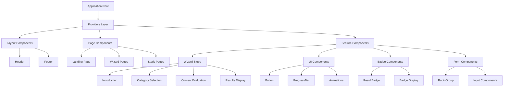

# Component Architecture Guide

## Overview

The Badge AI application follows a component-based architecture with clear separation of concerns, reusable UI elements, and consistent patterns throughout the application. The components are organized into distinct categories with specific responsibilities and well-defined interfaces.

## Component Organization Structure



## Core Component Categories

### Provider Components

**Translation Provider:**
```typescript
// src/contexts/TranslationContext.tsx
export const TranslationProvider: React.FC<{ children: ReactNode }> = ({ children }) => {
  const [language, setLanguage] = useState<string>('en');
  const [translations, setTranslations] = useState<Record<string, string>>(enTranslations);

  const t = useCallback((key: string): string => {
    return translations[key] || key;
  }, [translations]);

  useEffect(() => {
    const loadTranslations = async () => {
      const translationModule = await import(`../translations/${language}.ts`);
      setTranslations(translationModule.translations);
    };
    loadTranslations();
  }, [language]);

  return (
    <TranslationContext.Provider value={{ language, setLanguage, translations, t }}>
      {children}
    </TranslationContext.Provider>
  );
};
```

**Wizard Provider:**
```typescript
// src/contexts/WizardContext.tsx
export const WizardProvider: React.FC<{ children: ReactNode }> = ({ children }) => {
  const [step, setStep] = useState<number>(1);
  const [selectedCategories, setSelectedCategories] = useState<SelectedCategories>({
    sounds: false,
    visual: false,
    text: false,
  });
  const [soundsCategory, setSoundsCategory] = useState<Category>(null);
  const [visualCategory, setVisualCategory] = useState<Category>(null);
  const [textCategory, setTextCategory] = useState<Category>(null);
  const [isQuestionnaireMode, setQuestionnaireMode] = useState<boolean>(false);

  const value: WizardContextType = {
    step, setStep,
    selectedCategories, setSelectedCategories,
    soundsCategory, setSoundsCategory,
    visualCategory, setVisualCategory,
    textCategory, setTextCategory,
    isQuestionnaireMode, setQuestionnaireMode,
    // ... questionnaire state
  };

  return <WizardContext.Provider value={value}>{children}</WizardContext.Provider>;
};
```

### Layout Components

**Header Component:**
```typescript
// src/components/Header.tsx
interface HeaderProps {
  showWizard?: boolean;
  setShowWizard?: (show: boolean) => void;
}

export default function Header({ showWizard, setShowWizard }: HeaderProps) {
  const { t, language, setLanguage } = useTranslation();

  return (
    <header className="fixed top-0 left-0 right-0 z-50 bg-surface-dark/80 backdrop-blur-md border-b border-white/10">
      <div className="container mx-auto px-4 h-16 flex items-center justify-between">
        {/* Logo and Navigation */}
        <div className="flex items-center space-x-8">
          <Link href="/" className="flex items-center space-x-3">
            <Image src="/logo.png" alt="Badge AI" width={32} height={32} />
            <span className="text-xl font-bold text-text-primary">{t('appName')}</span>
          </Link>
          
          {/* Navigation Links */}
          <nav className="hidden md:flex items-center space-x-6">
            <Link href="/about" className="text-text-secondary hover:text-text-primary transition-colors">
              {t('about')}
            </Link>
            <Link href="/faq" className="text-text-secondary hover:text-text-primary transition-colors">
              {t('faq')}
            </Link>
          </nav>
        </div>

        {/* Language Switcher and Actions */}
        <div className="flex items-center space-x-4">
          <LanguageSwitcher />
          {showWizard && (
            <Button
              onClick={() => setShowWizard?.(false)}
              variant="outline"
              size="sm"
            >
              {t('backToHome')}
            </Button>
          )}
        </div>
      </div>
    </header>
  );
}
```

**Footer Component:**
```typescript
// src/components/Footer.tsx
export default function Footer() {
  const { t } = useTranslation();

  return (
    <footer className="bg-surface-card/20 border-t border-white/10 py-12">
      <div className="container mx-auto px-4">
        <div className="grid grid-cols-1 md:grid-cols-4 gap-8">
          {/* Brand Section */}
          <div className="space-y-4">
            <div className="flex items-center space-x-3">
              <Image src="/logo.png" alt="Badge AI" width={32} height={32} />
              <span className="text-xl font-bold text-text-primary">{t('appName')}</span>
            </div>
            <p className="text-text-secondary text-sm">{t('footerDescription')}</p>
          </div>

          {/* Links Sections */}
          <div className="space-y-4">
            <h4 className="font-semibold text-text-primary">{t('resources')}</h4>
            <nav className="flex flex-col space-y-2">
              <Link href="/about">{t('about')}</Link>
              <Link href="/faq">{t('faq')}</Link>
              <Link href="/contact">{t('contact')}</Link>
            </nav>
          </div>

          {/* Social and Legal */}
          <div className="space-y-4">
            <h4 className="font-semibold text-text-primary">{t('legal')}</h4>
            <nav className="flex flex-col space-y-2">
              <Link href="/privacy">{t('privacy')}</Link>
              <DonationButton />
            </nav>
          </div>
        </div>
      </div>
    </footer>
  );
}
```

### UI Components

**Button Component:**
```typescript
// src/components/Button.tsx
interface ButtonProps extends React.ButtonHTMLAttributes<HTMLButtonElement> {
  variant?: 'primary' | 'secondary' | 'outline' | 'ghost';
  size?: 'sm' | 'md' | 'lg';
  isLoading?: boolean;
  children: React.ReactNode;
}

export default function Button({
  variant = 'primary',
  size = 'md',
  isLoading = false,
  className = '',
  children,
  disabled,
  ...props
}: ButtonProps) {
  const baseClasses = "inline-flex items-center justify-center font-medium rounded-xl transition-all duration-200 focus:outline-none focus:ring-2 focus:ring-primary-500 focus:ring-offset-2 focus:ring-offset-surface-dark disabled:opacity-50 disabled:cursor-not-allowed";
  
  const variantClasses = {
    primary: "bg-primary-500 hover:bg-primary-400 text-white shadow-lg hover:shadow-xl",
    secondary: "bg-accent-indigo hover:bg-accent-indigo/90 text-white shadow-lg hover:shadow-xl",
    outline: "border border-white/20 hover:border-primary-500/50 text-text-primary hover:bg-primary-500/10",
    ghost: "text-text-primary hover:bg-surface-card/50"
  };

  const sizeClasses = {
    sm: "px-3 py-2 text-sm",
    md: "px-6 py-3 text-base",
    lg: "px-8 py-4 text-lg"
  };

  return (
    <motion.button
      className={`${baseClasses} ${variantClasses[variant]} ${sizeClasses[size]} ${className}`}
      disabled={disabled || isLoading}
      whileHover={{ scale: 1.02 }}
      whileTap={{ scale: 0.98 }}
      {...props}
    >
      {isLoading ? (
        <div className="flex items-center space-x-2">
          <div className="w-4 h-4 border-2 border-current border-t-transparent rounded-full animate-spin" />
          <span>Loading...</span>
        </div>
      ) : (
        children
      )}
    </motion.button>
  );
}
```

**ProgressBar Component:**
```typescript
// src/components/ProgressBar.tsx
interface ProgressBarProps {
  currentStep: number;
  totalSteps: number;
  onBack: () => void;
  onNext: () => void;
  canContinue: boolean;
  isQuestionnaireMode: boolean;
  currentQuestion: number;
  totalQuestions: number;
}

export default function ProgressBar({
  currentStep,
  totalSteps,
  onBack,
  onNext,
  canContinue,
  isQuestionnaireMode,
  currentQuestion,
  totalQuestions
}: ProgressBarProps) {
  const { t } = useTranslation();

  const progressPercentage = isQuestionnaireMode
    ? (currentQuestion / totalQuestions) * 100
    : (currentStep / totalSteps) * 100;

  return (
    <div className="space-y-4">
      {/* Progress Bar */}
      <div className="w-full">
        <div className="flex justify-between text-sm text-text-secondary mb-2">
          <span>
            {isQuestionnaireMode 
              ? `${t('question')} ${currentQuestion}/${totalQuestions}`
              : `${t('step')} ${currentStep}/${totalSteps}`
            }
          </span>
          <span>{Math.round(progressPercentage)}%</span>
        </div>
        
        <div className="w-full bg-surface-card/40 rounded-full h-2">
          <motion.div
            className="bg-gradient-to-r from-primary-500 to-accent-indigo h-2 rounded-full"
            initial={{ width: 0 }}
            animate={{ width: `${progressPercentage}%` }}
            transition={{ duration: 0.5, ease: "easeOut" }}
          />
        </div>
      </div>

      {/* Navigation Controls */}
      <div className="flex justify-between">
        <Button
          onClick={onBack}
          variant="outline"
          disabled={currentStep === 1}
        >
          <ChevronLeftIcon className="w-4 h-4 mr-2" />
          {t('back')}
        </Button>

        <Button
          onClick={onNext}
          disabled={!canContinue}
        >
          {t('next')}
          <ChevronRightIcon className="w-4 h-4 ml-2" />
        </Button>
      </div>
    </div>
  );
}
```

### Step Components

**Introduction Step:**
```typescript
// src/steps/Introduction.tsx
interface IntroductionProps {
  onNext: () => void;
}

export default function Introduction({ onNext }: IntroductionProps) {
  const { t } = useTranslation();

  return (
    <motion.div
      className="space-y-8"
      initial={{ opacity: 0, y: 20 }}
      animate={{ opacity: 1, y: 0 }}
      transition={{ duration: 0.6 }}
    >
      {/* Header */}
      <div className="text-center space-y-4">
        <h1 className="text-4xl md:text-5xl font-bold">
          <span className="animated-gradient-text">{t('welcomeTitle')}</span>
        </h1>
        <p className="text-xl text-text-secondary max-w-3xl mx-auto">
          {t('welcomeDescription')}
        </p>
      </div>

      {/* Feature Grid */}
      <div className="grid grid-cols-1 md:grid-cols-3 gap-6">
        {[
          { icon: ShieldCheckIcon, titleKey: 'transparencyTitle', descriptionKey: 'transparencyDescription' },
          { icon: SparklesIcon, titleKey: 'standardizationTitle', descriptionKey: 'standardizationDescription' },
          { icon: DocumentTextIcon, titleKey: 'exportTitle', descriptionKey: 'exportDescription' }
        ].map((feature, index) => (
          <FeatureCard
            key={feature.titleKey}
            icon={feature.icon}
            title={t(feature.titleKey)}
            description={t(feature.descriptionKey)}
            delay={index * 0.2}
          />
        ))}
      </div>

      {/* Call to Action */}
      <div className="text-center">
        <Button onClick={onNext} size="lg">
          {t('getStarted')}
          <ArrowRightIcon className="w-5 h-5 ml-2" />
        </Button>
      </div>
    </motion.div>
  );
}
```

**Category Selection Step:**
```typescript
// src/steps/ManualSelectionStep.tsx
interface ManualSelectionStepProps {
  onNext: () => void;
  onBack: () => void;
}

export default function ManualSelectionStep({ onNext, onBack }: ManualSelectionStepProps) {
  const { selectedCategories, setSelectedCategories } = useWizard();
  const { t } = useTranslation();

  const toggleCategory = (category: keyof SelectedCategories) => {
    setSelectedCategories(prev => ({
      ...prev,
      [category]: !prev[category]
    }));
  };

  const categories = [
    {
      key: 'sounds' as const,
      icon: '/icons/sounds-icon.svg',
      titleKey: 'soundsCategoryTitle',
      descriptionKey: 'soundsCategoryDescription',
      color: 'primary-500'
    },
    {
      key: 'visual' as const,
      icon: '/icons/visual-icon.svg',
      titleKey: 'visualCategoryTitle',
      descriptionKey: 'visualCategoryDescription',
      color: 'accent-indigo'
    },
    {
      key: 'text' as const,
      icon: '/icons/text-icon.svg',
      titleKey: 'textCategoryTitle',
      descriptionKey: 'textCategoryDescription',
      color: 'primary-600'
    }
  ];

  return (
    <motion.div
      className="space-y-8"
      initial={{ opacity: 0 }}
      animate={{ opacity: 1 }}
      transition={{ duration: 0.5 }}
    >
      <div className="text-center space-y-4">
        <h2 className="text-3xl font-bold text-text-primary">
          {t('categorySelectionTitle')}
        </h2>
        <p className="text-text-secondary max-w-2xl mx-auto">
          {t('categorySelectionDescription')}
        </p>
      </div>

      <div className="space-y-4">
        {categories.map((category, index) => (
          <CategorySelectionCard
            key={category.key}
            category={category}
            selected={selectedCategories[category.key]}
            onToggle={() => toggleCategory(category.key)}
            delay={index * 0.1}
          />
        ))}
      </div>

      <div className="text-center space-y-4">
        <p className="text-sm text-text-secondary">
          {Object.values(selectedCategories).filter(Boolean).length} {t('categoriesSelected')}
        </p>
        <div className="flex justify-center space-x-4">
          <Button onClick={onBack} variant="outline">
            {t('back')}
          </Button>
          <Button 
            onClick={onNext} 
            disabled={!Object.values(selectedCategories).some(Boolean)}
          >
            {t('next')}
          </Button>
        </div>
      </div>
    </motion.div>
  );
}
```

### Badge Components

**ResultBadge Component:**
```typescript
// src/components/ResultBadge.tsx
interface ResultBadgeProps {
  category: Category;
  contentType: 'sounds' | 'visual' | 'text';
  title: string;
  description: string;
  badgeCode: string;
  className?: string;
}

export default function ResultBadge({
  category,
  contentType,
  title,
  description,
  badgeCode,
  className = ''
}: ResultBadgeProps) {
  const gradientClasses = {
    0: "from-blue-500 to-blue-600",
    1: "from-red-500 to-red-600",
    2: "from-orange-500 to-orange-600",
    3: "from-yellow-500 to-yellow-600",
    4: "from-green-500 to-green-600"
  };

  const iconComponents = {
    0: <UserIcon className="w-5 h-5" />,
    1: <PlayIcon className="w-5 h-5" />,
    2: <PencilIcon className="w-5 h-5" />,
    3: <UserGroupIcon className="w-5 h-5" />,
    4: <FaceSmileIcon className="w-5 h-5" />
  };

  return (
    <motion.div
      className={`
        relative overflow-hidden rounded-2xl p-6 
        bg-gradient-to-br ${gradientClasses[category]}
        shadow-xl hover:shadow-2xl transition-all duration-300
        ${className}
      `}
      whileHover={{ 
        scale: 1.02, 
        y: -4,
        boxShadow: "0 25px 50px -12px rgba(0, 0, 0, 0.25)"
      }}
      whileTap={{ scale: 0.98 }}
      initial={{ opacity: 0, y: 20 }}
      animate={{ opacity: 1, y: 0 }}
      transition={{ duration: 0.5 }}
    >
      {/* Background Pattern */}
      <div className="absolute inset-0 opacity-10">
        <div className="absolute top-0 right-0 w-32 h-32 bg-white rounded-full -translate-y-16 translate-x-16" />
        <div className="absolute bottom-0 left-0 w-24 h-24 bg-white rounded-full translate-y-12 -translate-x-12" />
      </div>

      {/* Content */}
      <div className="relative z-10">
        <div className="flex items-center justify-between mb-4">
          <div className="flex items-center space-x-3">
            <div className="w-12 h-12 relative">
              <Image
                src={`/badges/category-${category}.svg`}
                alt={`Category ${category}`}
                fill
                className="object-contain"
              />
            </div>
            <div>
              <h3 className="font-semibold text-white">{title}</h3>
              <p className="text-white/80 text-sm">{description}</p>
            </div>
          </div>
          {iconComponents[category]}
        </div>

        <div className="bg-black/20 backdrop-blur-sm rounded-xl p-3 text-center">
          <span className="font-mono font-bold text-white text-lg">
            {badgeCode}
          </span>
        </div>
      </div>
    </motion.div>
  );
}
```

## Animation and Interaction Patterns

### Framer Motion Integration

**Page Transitions:**
```typescript
// Common animation variants
const pageVariants = {
  initial: { opacity: 0, y: 20 },
  animate: { opacity: 1, y: 0 },
  exit: { opacity: 0, y: -20 }
};

const staggerContainer = {
  animate: {
    transition: {
      staggerChildren: 0.1
    }
  }
};

// Usage in components
<motion.div
  variants={staggerContainer}
  initial="initial"
  animate="animate"
  className="space-y-6"
>
  {items.map((item, index) => (
    <motion.div
      key={item.id}
      variants={pageVariants}
      transition={{ delay: index * 0.1 }}
    >
      {item.content}
    </motion.div>
  ))}
</motion.div>
```

**Interactive Elements:**
```typescript
// Hover and tap animations
const buttonVariants = {
  hover: { scale: 1.05, y: -2 },
  tap: { scale: 0.95 }
};

// Loading states
const loadingVariants = {
  animate: {
    rotate: 360,
    transition: {
      duration: 1,
      repeat: Infinity,
      ease: "linear"
    }
  }
};
```

## Component Communication Patterns

### Context-Based Communication

Components communicate through React Context rather than prop drilling:

```typescript
// Context consumption pattern
const SomeComponent = () => {
  const { step, setStep, selectedCategories } = useWizard();
  const { t, language } = useTranslation();
  
  // Component logic using context values
  const handleNext = () => {
    setStep(step + 1);
  };
  
  return (
    <div>
      <h1>{t('componentTitle')}</h1>
      {/* Component content */}
    </div>
  );
};
```

### Event-Based Communication

Analytics and external integrations use event patterns:

```typescript
// Event tracking in components
const handleUserAction = () => {
  // Perform action
  updateState();
  
  // Track analytics
  trackEvent('user_action', {
    component: 'ComponentName',
    action: 'specific_action',
    context: additionalData
  });
};
```

## Styling and Design System

### Tailwind CSS Integration

The component system uses a consistent design system with Tailwind CSS:

```typescript
// Common class patterns
const designTokens = {
  // Colors
  primary: 'primary-500',
  primaryHover: 'primary-400',
  surface: 'surface-dark',
  surfaceCard: 'surface-card',
  textPrimary: 'text-primary',
  textSecondary: 'text-secondary',
  
  // Spacing
  containerPadding: 'px-4 sm:px-6',
  sectionSpacing: 'py-16',
  componentSpacing: 'space-y-6',
  
  // Effects
  glassMorphism: 'backdrop-blur-sm bg-surface-card/40 border border-white/10',
  shadow: 'shadow-xl hover:shadow-2xl',
  rounded: 'rounded-2xl'
};
```

### Component Styling Patterns

```typescript
// Consistent component styling
const ComponentStylePattern = {
  container: "glass-panel p-6 md:p-8",
  header: "text-center space-y-4 mb-8",
  title: "text-3xl font-bold text-text-primary",
  description: "text-text-secondary max-w-2xl mx-auto",
  content: "space-y-6",
  actions: "flex justify-center space-x-4"
};
```

## Testing and Development Patterns

### Component Testing Approach

```typescript
// Component testing pattern
import { render, screen, fireEvent } from '@testing-library/react';
import { WizardProvider } from '@/contexts/WizardContext';
import { TranslationProvider } from '@/contexts/TranslationContext';

const TestWrapper = ({ children }: { children: React.ReactNode }) => (
  <TranslationProvider>
    <WizardProvider>
      {children}
    </WizardProvider>
  </TranslationProvider>
);

describe('ComponentName', () => {
  it('renders correctly with required props', () => {
    render(
      <ComponentName prop1="value1" prop2="value2" />,
      { wrapper: TestWrapper }
    );
    
    expect(screen.getByText('Expected Text')).toBeInTheDocument();
  });

  it('handles user interactions', () => {
    const mockHandler = jest.fn();
    render(
      <ComponentName onAction={mockHandler} />,
      { wrapper: TestWrapper }
    );
    
    fireEvent.click(screen.getByRole('button', { name: 'Action Button' }));
    expect(mockHandler).toHaveBeenCalledWith(expectedArguments);
  });
});
```

The component architecture provides a scalable foundation for building consistent, interactive user interfaces while maintaining clear separation of concerns and reusable patterns throughout the application.