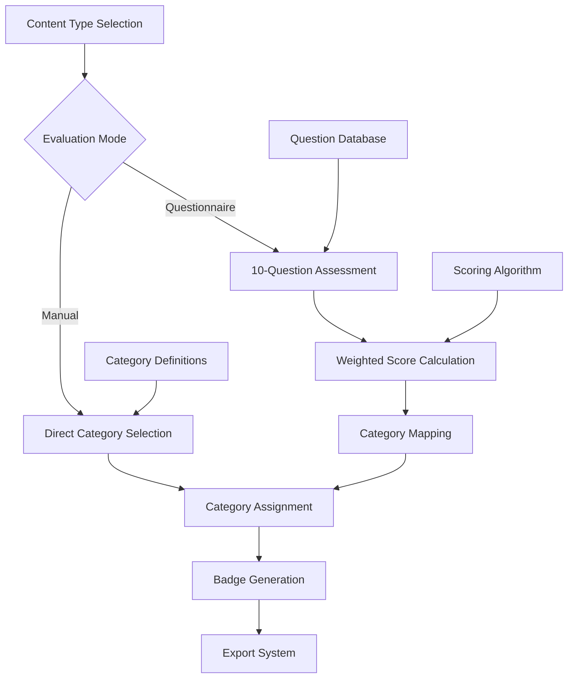
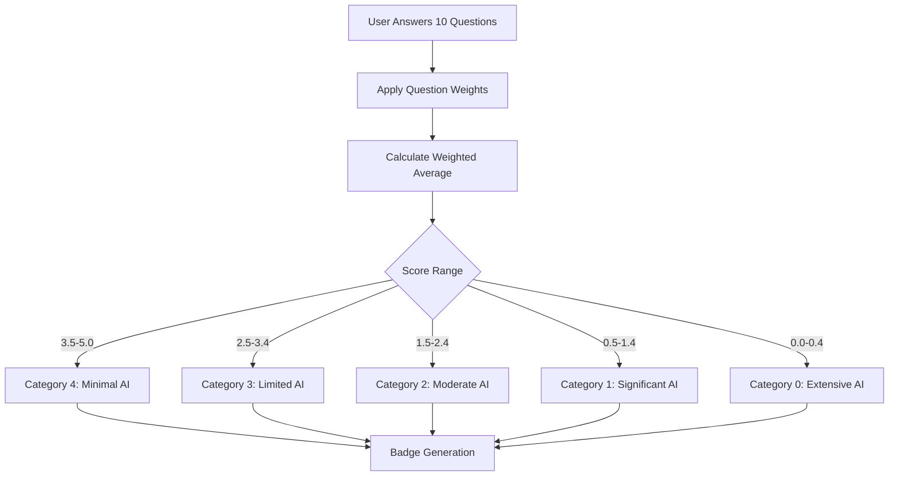

# Evaluation System Architecture

## Overview

The Badge AI evaluation system provides two distinct methods for assessing AI usage in creative content: manual category selection and questionnaire-based assessment. The system supports three content types (sounds, visual, text) with a standardized 5-level classification (0-4) representing varying degrees of AI involvement.

## Evaluation Architecture



## Category Classification System

### AI Usage Levels (0-4 Scale)

The system uses a standardized 5-level classification across all content types:

```typescript
// src/types/index.ts
export type Category = 0 | 1 | 2 | 3 | 4 | null;

// Category definitions (from translation keys)
// 0: Human Only - Exclusively human-created without AI assistance
// 1: Human with AI Assistance - Primarily human with minor AI help  
// 2: AI Collaboration - Balanced collaboration between human and AI
// 3: Directed AI - AI generation with significant human prompting/editing
// 4: AI Only - Fully AI-generated without human editing
```

### Content Type Categories

Each content type has specific category options tailored to its domain:

**Sounds/Music Categories:**
```typescript
export const soundsCategoryOptions: CategoryOption[] = [
  { id: 0, titleKey: "soundsCategory0Title", descriptionKey: "soundsCategory0Description" },
  { id: 1, titleKey: "soundsCategory1Title", descriptionKey: "soundsCategory1Description" },
  { id: 2, titleKey: "soundsCategory2Title", descriptionKey: "soundsCategory2Description" },
  { id: 3, titleKey: "soundsCategory3Title", descriptionKey: "soundsCategory3Description" },
  { id: 4, titleKey: "soundsCategory4Title", descriptionKey: "soundsCategory4Description" }
];
```

**Visual Content Categories:**
```typescript
export const visualCategoryOptions: CategoryOption[] = [
  // Similar structure for visual content evaluation
  // Covers digital art, image generation, design elements
];
```

**Text Content Categories:**
```typescript
export const textCategoryOptions: CategoryOption[] = [
  // Similar structure for written content evaluation  
  // Covers writing, editing, content creation
];
```

## Manual Selection Mode

### Direct Category Selection Implementation

The manual mode provides immediate category selection through visual interface cards:

```typescript
// src/steps/SoundsStep.tsx
export default function SoundsStep({ onNext, onBack }: StepProps) {
  const { soundsCategory, setSoundsCategory } = useWizard();
  const { t } = useTranslation();

  return (
    <div className="space-y-6">
      {soundsCategoryOptions.map(option => (
        <CategoryCard
          key={option.id}
          selected={soundsCategory === option.id}
          onClick={() => setSoundsCategory(option.id)}
          category={option.id}
          title={t(option.titleKey)}
          description={t(option.descriptionKey)}
          badgeIcon={`/badges/category-${option.id}.svg`}
        />
      ))}
    </div>
  );
}
```

### Category Card Component Pattern

```typescript
// Category selection card with visual feedback
<motion.button
  onClick={() => setSoundsCategory(option.id)}
  className={`
    category-selection-card p-6 rounded-2xl border transition-all
    ${soundsCategory === option.id 
      ? 'border-primary-500 bg-primary-500/20 shadow-glow' 
      : 'border-white/10 bg-surface-card/40 hover:border-primary-500/50'
    }
  `}
  whileHover={{ scale: 1.02 }}
  whileTap={{ scale: 0.98 }}
>
  <div className="flex items-center space-x-6">
    <div className="w-16 h-16 relative">
      <Image 
        src={`/badges/category-${option.id}.svg`}
        alt={`Category ${option.id}`}
        fill
        className="object-contain"
      />
    </div>
    <div className="flex-1 text-left">
      <h3 className="text-lg font-semibold text-text-primary mb-2">
        {t(option.titleKey)}
      </h3>
      <p className="text-text-secondary">
        {t(option.descriptionKey)}
      </p>
    </div>
    {soundsCategory === option.id && (
      <CheckCircleIcon className="w-6 h-6 text-primary-400" />
    )}
  </div>
</motion.button>
```

## Questionnaire Assessment System

### Question Structure and Database

The system includes comprehensive questionnaire databases for detailed assessment:

**Music/Sounds Questions (10 Questions):**
```typescript
// src/types/index.ts (lines 201-481)
export const musicQuestions: QuestionItem[] = [
  {
    id: "q1",
    text: "How was the musical material (melody, harmony, rhythm) created?",
    options: [
      { id: "a", text: "Entirely generated by AI without modification", points: 4 },
      { id: "b", text: "Generated by AI, then selected from multiple proposals", points: 3 },
      { id: "c", text: "Co-created with significant AI assistance", points: 2 },
      { id: "d", text: "Primarily created by human with AI suggestions", points: 1 },
      { id: "e", text: "Entirely composed by human without AI suggestions", points: 0 }
    ]
  },
  // ... 9 more detailed questions covering:
  // - Prompting level and direction
  // - Musical structure determination  
  // - Sound and instrument selection
  // - Mixing and arrangement
  // - Effects and audio processing
  // - Vocal/solo performance
  // - Post-production and mastering
  // - AI percentage estimation
  // - Human intervention level
];
```

**Text Content Questions (10 Questions):**
```typescript
// src/types/index.ts (lines 483-747)
export const textQuestions: QuestionItem[] = [
  {
    id: "q1", 
    text: "How were the main concepts and ideas generated?",
    options: [
      { id: "a", text: "Entirely proposed by AI without modification", points: 1 },
      { id: "b", text: "Generated by AI, then selected from proposals", points: 2 },
      { id: "c", text: "Co-created with significant AI assistance", points: 3 },
      { id: "d", text: "Primarily conceived by human with AI suggestions", points: 4 },
      { id: "e", text: "Entirely conceived by human without AI suggestions", points: 5 }
    ]
  },
  // ... 9 more questions covering:
  // - Prompting strategies and iteration
  // - Narrative/argumentative structure  
  // - First draft production
  // - Vocabulary and phrasing selection
  // - Examples and metaphor creation
  // - Revision and editing process
  // - Coherence and flow management
  // - AI percentage estimation
  // - Human contribution level
];
```

### Weighted Scoring Algorithm

The questionnaire system implements sophisticated weighted scoring for critical questions:

**Question Weights Configuration:**
```typescript
// Music question weights
export const musicQuestionWeights: Record<string, number> = {
  q1: 1.5,  // Material creation (most important)
  q9: 1.5,  // AI percentage (quantitative measure)
  q10: 1.2  // Main intervention (overall assessment)
};

// Text question weights  
export const textQuestionWeights: Record<string, number> = {
  q4: 1.5,  // First draft production (critical for text)
  q9: 1.5,  // AI percentage (quantitative measure)
  q10: 1.2  // Main contribution (overall assessment)
};
```

**Category Calculation Algorithm:**
```typescript
// src/types/index.ts (lines 764-787)
export const calculateCategory = (
  answers: Record<string, number>,
  weights: Record<string, number>
): Category => {
  let totalPoints = 0;
  let totalWeight = 0;

  // Calculate weighted average
  Object.entries(answers).forEach(([questionId, points]) => {
    const weight = weights[questionId] || 1;
    totalPoints += points * weight;
    totalWeight += weight;
  });

  const score = totalPoints / totalWeight;

  // Map weighted score to category (0-4 scale)
  if (score >= 3.5) return 4; // Minimal AI (4.0-5.0 range)
  if (score >= 2.5) return 3; // Limited AI (3.0-3.9 range)  
  if (score >= 1.5) return 2; // Moderate AI (2.0-2.9 range)
  if (score >= 0.5) return 1; // Significant AI (1.0-1.9 range)
  if (score >= 0) return 0;   // Extensive AI (0.0-0.9 range)

  return null;
};
```

### Scoring Logic Flow



## Implementation Status and Gaps

### Current Manual Mode Implementation

**✅ Fully Implemented:**
- Direct category selection for all content types
- Visual feedback with badge previews
- Immediate category assignment
- Progress tracking and navigation

```typescript
// Working implementation in step components
const { soundsCategory, setSoundsCategory } = useWizard();

// Direct assignment on selection
onClick={() => setSoundsCategory(option.id)}
```

### Current Questionnaire Mode Status

**⚠️ Partially Implemented:**

The sophisticated questionnaire system exists in the type definitions but has simplified UI implementation:

**Defined but Not Connected:**
```typescript
// Comprehensive question database exists
export const musicQuestions: QuestionItem[] = [/* 10 detailed questions */];
export const textQuestions: QuestionItem[] = [/* 10 detailed questions */];

// Weighted scoring algorithm exists  
export const calculateCategory = (answers, weights) => {/* sophisticated logic */};

// Question weights defined
export const musicQuestionWeights = {/* weighted scoring */};
```

**Current Simple Implementation:**
```typescript
// src/steps/SoundsQuestionnaire.tsx (simplified version)
const [currentQuestion, setCurrentQuestion] = useState(0);
const [answers, setAnswers] = useState<Record<string, number>>({});

// Simple averaging instead of weighted algorithm
const totalPoints = Object.values(answers).reduce((sum, points) => sum + points, 0);
const averagePoints = totalPoints / questions.length;
const category = Math.round(averagePoints) as Category;
```

### Visual Content Questionnaire Gap

**❌ Missing Implementation:**
- Visual content questionnaire questions are not defined in the types
- No `visualQuestions` array exists
- Visual questionnaire component exists but uses placeholder logic

## Extension and Integration Patterns

### Adding New Content Types

**1. Define Category Options:**
```typescript
export const newTypeCategoryOptions: CategoryOption[] = [
  { id: 0, titleKey: "newType0Title", descriptionKey: "newType0Description" },
  // ... categories 1-4
];
```

**2. Create Questionnaire Database:**
```typescript
export const newTypeQuestions: QuestionItem[] = [
  {
    id: "q1",
    text: "Domain-specific evaluation question",
    options: [
      { id: "a", text: "High AI involvement", points: 1 },
      { id: "e", text: "No AI involvement", points: 5 }
    ]
  },
  // ... 9 more questions
];

export const newTypeWeights: Record<string, number> = {
  q1: 1.5, // Critical questions get higher weight
  q9: 1.5, // AI percentage question
  q10: 1.2 // Overall assessment question
};
```

**3. Update State Management:**
```typescript
// Add to WizardContextType
interface WizardContextType {
  // ... existing properties
  newTypeCategory: Category;
  setNewTypeCategory: (category: Category) => void;
  newTypeQuestionnaireAnswers: Record<string, number>;
  setNewTypeQuestionnaireAnswers: (answers: Record<string, number>) => void;
}
```

**4. Create Step Components:**
```typescript
// src/steps/NewTypeStep.tsx
export default function NewTypeStep({ onNext, onBack }: StepProps) {
  const { newTypeCategory, setNewTypeCategory } = useWizard();
  
  return (
    <div className="space-y-6">
      {newTypeCategoryOptions.map(option => (
        <CategoryCard 
          key={option.id}
          selected={newTypeCategory === option.id}
          onClick={() => setNewTypeCategory(option.id)}
          // ... card props
        />
      ))}
    </div>
  );
}
```

### Completing Questionnaire Implementation

**1. Connect Comprehensive Questions:**
```typescript
// Replace simplified questionnaire with full implementation
import { musicQuestions, musicQuestionWeights, calculateCategory } from '@/types';

export default function SoundsQuestionnaire({ onNext, onBack }: StepProps) {
  const [currentQuestion, setCurrentQuestion] = useState(0);
  const [answers, setAnswers] = useState<Record<string, number>>({});
  const { setSoundsCategory } = useWizard();

  const handleAnswer = (questionId: string, points: number) => {
    const newAnswers = { ...answers, [questionId]: points };
    setAnswers(newAnswers);
    
    // Use sophisticated weighted calculation
    if (Object.keys(newAnswers).length === musicQuestions.length) {
      const category = calculateCategory(newAnswers, musicQuestionWeights);
      setSoundsCategory(category);
    }
  };

  // Render full question flow with progress tracking
  return (
    <QuestionnaireInterface
      questions={musicQuestions}
      currentQuestion={currentQuestion}
      onAnswer={handleAnswer}
      onNext={() => setCurrentQuestion(q => q + 1)}
      onBack={() => setCurrentQuestion(q => q - 1)}
    />
  );
}
```

**2. Add Visual Content Questions:**
```typescript
// Define missing visual content questionnaire
export const visualQuestions: QuestionItem[] = [
  {
    id: "q1",
    text: "How were the visual elements created?",
    options: [
      { id: "a", text: "Entirely AI-generated", points: 1 },
      { id: "e", text: "Entirely human-created", points: 5 }
    ]
  },
  // ... 9 more questions specific to visual content
];

export const visualQuestionWeights: Record<string, number> = {
  q1: 1.5, // Visual creation method
  q9: 1.5, // AI percentage
  q10: 1.2 // Overall contribution
};
```

The evaluation system provides a robust foundation for AI usage assessment with clear paths for extending both manual selection and questionnaire-based evaluation modes.