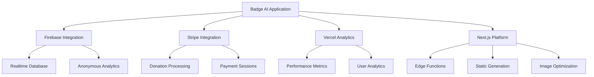

# External Integrations Architecture

## Overview

Badge AI integrates with several external services to provide analytics tracking, payment processing, performance monitoring, and enhanced user experience. The integrations are designed with privacy-first principles and minimal data collection while maintaining system functionality and insights.

## Integration Architecture



## Firebase Integration

### Configuration and Setup

Firebase provides anonymous analytics tracking and user interaction logging:

```typescript
// src/lib/firebase-config.ts
import { initializeApp } from "firebase/app";
import { getDatabase } from "firebase/database";

const firebaseConfig = {
  apiKey: process.env.NEXT_PUBLIC_FIREBASE_API_KEY,
  authDomain: process.env.NEXT_PUBLIC_FIREBASE_AUTH_DOMAIN,
  projectId: process.env.NEXT_PUBLIC_FIREBASE_PROJECT_ID,
  storageBucket: process.env.NEXT_PUBLIC_FIREBASE_STORAGE_BUCKET,
  messagingSenderId: process.env.NEXT_PUBLIC_FIREBASE_MESSAGING_SENDER_ID,
  appId: process.env.NEXT_PUBLIC_FIREBASE_APP_ID,
  databaseURL: process.env.NEXT_PUBLIC_FIREBASE_DATABASE_URL,
};

export const app = initializeApp(firebaseConfig);
export const db = getDatabase(app);
```

### Analytics Implementation

Enhanced analytics service for tracking user interactions:

```typescript
// src/lib/enhanced-analytics.ts
import { ref, push } from "firebase/database";
import { db } from "./firebase-config";

interface AnalyticsEvent {
  type: string;
  timestamp: number;
  data: Record<string, any>;
  sessionId?: string;
  userAgent?: string;
}

export const trackEvent = async (eventType: string, eventData: Record<string, any>) => {
  try {
    const event: AnalyticsEvent = {
      type: eventType,
      timestamp: Date.now(),
      data: eventData,
      sessionId: generateSessionId(),
      userAgent: typeof window !== 'undefined' ? window.navigator.userAgent : undefined
    };

    // Push to Firebase Realtime Database
    await push(ref(db, 'events'), event);
    
    console.log(`Analytics event tracked: ${eventType}`, eventData);
  } catch (error) {
    console.error('Failed to track analytics event:', error);
  }
};

// Session management
let sessionId: string | null = null;

const generateSessionId = (): string => {
  if (!sessionId) {
    sessionId = `session_${Date.now()}_${Math.random().toString(36).substr(2, 9)}`;
  }
  return sessionId;
};

// Common event tracking functions
export const trackWizardStepCompleted = (step: number, selectedCategories: Record<string, boolean>) => {
  trackEvent('wizard_step_completed', {
    step,
    selectedCategories,
    categoriesSelected: Object.values(selectedCategories).filter(Boolean).length
  });
};

export const trackBadgeGenerated = (data: {
  contentTypes: string[];
  categories: Record<string, number>;
  exportFormat?: string;
}) => {
  trackEvent('badge_generated', {
    contentTypes: data.contentTypes,
    categories: data.categories,
    totalBadges: data.contentTypes.length,
    exportFormat: data.exportFormat || 'none'
  });
};

export const trackBadgeExported = (format: string, badgeCount: number) => {
  trackEvent('badge_exported', {
    exportFormat: format,
    badgeCount,
    timestamp: Date.now()
  });
};

export const trackLanguageChanged = (previousLanguage: string, newLanguage: string) => {
  trackEvent('language_changed', {
    from: previousLanguage,
    to: newLanguage
  });
};
```

### Analytics Tracker Component

Component that handles automatic analytics tracking:

```typescript
// src/components/AnalyticsTracker.tsx
"use client";

import { useEffect } from 'react';
import { useWizard } from '@/contexts/WizardContext';
import { useTranslation } from '@/contexts/TranslationContext';
import { trackEvent, trackWizardStepCompleted, trackLanguageChanged } from '@/lib/enhanced-analytics';

export default function AnalyticsTracker() {
  const { step, selectedCategories, soundsCategory, visualCategory, textCategory } = useWizard();
  const { language } = useTranslation();

  // Track page load
  useEffect(() => {
    trackEvent('page_loaded', {
      path: window.location.pathname,
      referrer: document.referrer,
      timestamp: Date.now()
    });
  }, []);

  // Track wizard step changes
  useEffect(() => {
    if (step > 1) {
      trackWizardStepCompleted(step, selectedCategories);
    }
  }, [step, selectedCategories]);

  // Track category selections
  useEffect(() => {
    const categories = {
      sounds: soundsCategory,
      visual: visualCategory,
      text: textCategory
    };

    const selectedCount = Object.values(categories).filter(cat => cat !== null).length;
    
    if (selectedCount > 0) {
      trackEvent('category_selected', {
        categories,
        selectedCount,
        completedEvaluations: selectedCount
      });
    }
  }, [soundsCategory, visualCategory, textCategory]);

  // Track language changes
  useEffect(() => {
    const previousLanguage = localStorage.getItem('previousLanguage');
    if (previousLanguage && previousLanguage !== language) {
      trackLanguageChanged(previousLanguage, language);
    }
    localStorage.setItem('previousLanguage', language);
  }, [language]);

  return null; // This component doesn't render anything
}
```

### Database Security Rules

Firebase security rules ensure data privacy:

```json
// firebase.rules.json
{
  "rules": {
    "events": {
      ".write": true,
      ".read": false,
      "$eventId": {
        ".validate": "newData.hasChildren(['type', 'timestamp', 'data'])"
      }
    },
    "analytics": {
      ".write": true,
      ".read": false
    }
  }
}
```

## Stripe Integration

### Payment Configuration

Stripe integration for donation processing:

```typescript
// src/app/api/create-donation-session/route.ts
import { NextRequest, NextResponse } from 'next/server';
import Stripe from 'stripe';

const stripe = new Stripe(process.env.STRIPE_SECRET_KEY!, {
  apiVersion: '2024-06-20',
});

export async function POST(request: NextRequest) {
  try {
    const { amount } = await request.json();

    // Validate amount
    if (!amount || amount < 100) { // Minimum $1.00
      return NextResponse.json(
        { error: 'Invalid amount' },
        { status: 400 }
      );
    }

    // Create Stripe checkout session
    const session = await stripe.checkout.sessions.create({
      payment_method_types: ['card'],
      line_items: [
        {
          price_data: {
            currency: 'usd',
            product_data: {
              name: 'Badge AI Donation',
              description: 'Support AI transparency in creative works',
              images: ['https://badgeai.org/logo.png'],
            },
            unit_amount: amount,
          },
          quantity: 1,
        },
      ],
      mode: 'payment',
      success_url: `${request.headers.get('origin')}/donation/success?session_id={CHECKOUT_SESSION_ID}`,
      cancel_url: `${request.headers.get('origin')}/`,
      metadata: {
        purpose: 'donation',
        platform: 'badge-ai',
      },
    });

    return NextResponse.json({ sessionId: session.id });
  } catch (error) {
    console.error('Stripe session creation error:', error);
    return NextResponse.json(
      { error: 'Failed to create payment session' },
      { status: 500 }
    );
  }
}
```

### Donation Component

Frontend component for handling donations:

```typescript
// src/components/DonationButton.tsx
"use client";

import { useState } from 'react';
import { loadStripe } from '@stripe/stripe-js';
import { useTranslation } from '@/contexts/TranslationContext';
import { trackEvent } from '@/lib/enhanced-analytics';
import Button from './Button';
import { HeartIcon } from '@heroicons/react/24/outline';

const stripePromise = loadStripe(process.env.NEXT_PUBLIC_STRIPE_PUBLISHABLE_KEY!);

export default function DonationButton() {
  const [isLoading, setIsLoading] = useState(false);
  const { t } = useTranslation();

  const handleDonation = async (amount: number) => {
    setIsLoading(true);
    
    try {
      // Track donation initiation
      trackEvent('donation_initiated', { amount });

      // Create Stripe session
      const response = await fetch('/api/create-donation-session', {
        method: 'POST',
        headers: {
          'Content-Type': 'application/json',
        },
        body: JSON.stringify({ amount: amount * 100 }), // Convert to cents
      });

      const { sessionId } = await response.json();

      // Redirect to Stripe checkout
      const stripe = await stripePromise;
      const { error } = await stripe!.redirectToCheckout({ sessionId });

      if (error) {
        console.error('Stripe redirect error:', error);
        trackEvent('donation_error', { error: error.message, amount });
      }
    } catch (error) {
      console.error('Donation error:', error);
      trackEvent('donation_error', { error: String(error), amount });
    } finally {
      setIsLoading(false);
    }
  };

  return (
    <div className="space-y-4">
      <h3 className="text-lg font-semibold text-text-primary">{t('supportProject')}</h3>
      <div className="flex flex-wrap gap-2">
        {[5, 10, 25, 50].map(amount => (
          <Button
            key={amount}
            onClick={() => handleDonation(amount)}
            variant="outline"
            size="sm"
            isLoading={isLoading}
            className="min-w-[80px]"
          >
            <HeartIcon className="w-4 h-4 mr-1" />
            ${amount}
          </Button>
        ))}
      </div>
      <p className="text-sm text-text-secondary">
        {t('donationDescription')}
      </p>
    </div>
  );
}
```

### Donation Success Handling

Success page for completed donations:

```typescript
// src/app/donation/success/page.tsx
"use client";

import { useEffect, Suspense } from 'react';
import { useSearchParams } from 'next/navigation';
import { trackEvent } from '@/lib/enhanced-analytics';

function DonationSuccessContent() {
  const searchParams = useSearchParams();
  const sessionId = searchParams.get('session_id');

  useEffect(() => {
    if (sessionId) {
      trackEvent('donation_completed', {
        sessionId,
        timestamp: Date.now()
      });
    }
  }, [sessionId]);

  return (
    <div className="min-h-screen flex items-center justify-center bg-gradient-to-b from-surface-dark to-surface-card">
      <div className="max-w-md mx-auto text-center space-y-6 p-8">
        <div className="w-20 h-20 bg-green-500 rounded-full flex items-center justify-center mx-auto">
          <CheckIcon className="w-10 h-10 text-white" />
        </div>
        
        <h1 className="text-2xl font-bold text-text-primary">
          Thank You!
        </h1>
        
        <p className="text-text-secondary">
          Your donation helps support AI transparency in creative works.
        </p>
        
        <Button onClick={() => window.location.href = '/'}>
          Return to Badge AI
        </Button>
      </div>
    </div>
  );
}

export default function DonationSuccess() {
  return (
    <Suspense fallback={<div>Loading...</div>}>
      <DonationSuccessContent />
    </Suspense>
  );
}
```

## Vercel Analytics Integration

### Performance and User Analytics

Vercel Analytics provides performance monitoring and user insights:

```typescript
// src/app/layout.tsx
import { Analytics } from "@vercel/analytics/react";

export default function RootLayout({
  children,
}: {
  children: React.ReactNode;
}) {
  return (
    <html lang="en">
      <body>
        <TranslationProvider>
          <WizardProvider>
            {/* Application content */}
            {children}
            <AnalyticsTracker />
          </WizardProvider>
        </TranslationProvider>
        {/* Vercel Analytics */}
        <Analytics />
      </body>
    </html>
  );
}
```

### Custom Events Tracking

Integration with Vercel Analytics for custom events:

```typescript
// Enhanced analytics with Vercel integration
import { track } from '@vercel/analytics';

export const trackWithVercel = (eventName: string, eventData: Record<string, any>) => {
  // Track with Firebase
  trackEvent(eventName, eventData);
  
  // Track with Vercel Analytics
  track(eventName, eventData);
};

// Usage in components
export const trackBadgeGeneratedWithAnalytics = (data: any) => {
  trackWithVercel('badge_generated', {
    content_types: data.contentTypes.join(','),
    category_count: data.contentTypes.length,
    timestamp: new Date().toISOString()
  });
};
```

## Environment Configuration

### Environment Variables

Required environment variables for integrations:

```bash
# .env.local (not committed to repository)

# Firebase Configuration
NEXT_PUBLIC_FIREBASE_API_KEY=your_firebase_api_key
NEXT_PUBLIC_FIREBASE_AUTH_DOMAIN=your_project.firebaseapp.com
NEXT_PUBLIC_FIREBASE_PROJECT_ID=your_project_id
NEXT_PUBLIC_FIREBASE_STORAGE_BUCKET=your_project.appspot.com
NEXT_PUBLIC_FIREBASE_MESSAGING_SENDER_ID=your_sender_id
NEXT_PUBLIC_FIREBASE_APP_ID=your_app_id
NEXT_PUBLIC_FIREBASE_DATABASE_URL=https://your_project.firebaseio.com

# Stripe Configuration
NEXT_PUBLIC_STRIPE_PUBLISHABLE_KEY=pk_live_or_test_key
STRIPE_SECRET_KEY=sk_live_or_test_key

# Application Configuration
NEXT_PUBLIC_APP_URL=https://badgeai.org
```

### Vercel Deployment Configuration

Vercel configuration for production deployment:

```json
// vercel.json
{
  "version": 2,
  "buildCommand": "npm run build",
  "installCommand": "npm install",
  "framework": "nextjs",
  "build": {
    "env": {
      "NODE_OPTIONS": "--max-old-space-size=8192"
    }
  },
  "git": {
    "deploymentEnabled": {
      "main": true
    }
  },
  "functions": {
    "src/app/api/**/*.ts": {
      "maxDuration": 30
    }
  }
}
```

## Error Handling and Monitoring

### Integration Error Handling

Comprehensive error handling for external service failures:

```typescript
// src/lib/error-handling.ts
export const handleIntegrationError = (service: string, error: any, context?: Record<string, any>) => {
  const errorData = {
    service,
    error: error.message || String(error),
    context: context || {},
    timestamp: Date.now(),
    userAgent: typeof window !== 'undefined' ? window.navigator.userAgent : undefined
  };

  // Log locally
  console.error(`${service} integration error:`, errorData);

  // Track error event (if Firebase is available)
  try {
    trackEvent('integration_error', errorData);
  } catch (trackingError) {
    console.error('Failed to track integration error:', trackingError);
  }

  // Return user-friendly error message
  return `${service} is temporarily unavailable. Please try again later.`;
};

// Usage example
export const safeTrackEvent = async (eventType: string, eventData: Record<string, any>) => {
  try {
    await trackEvent(eventType, eventData);
  } catch (error) {
    handleIntegrationError('Firebase Analytics', error, { eventType, eventData });
  }
};
```

### Service Health Monitoring

Basic health check for external services:

```typescript
// src/lib/service-health.ts
interface ServiceStatus {
  firebase: boolean;
  stripe: boolean;
  vercel: boolean;
}

export const checkServiceHealth = async (): Promise<ServiceStatus> => {
  const status: ServiceStatus = {
    firebase: false,
    stripe: false,
    vercel: true // Vercel is always available in this context
  };

  // Check Firebase
  try {
    await trackEvent('health_check', { timestamp: Date.now() });
    status.firebase = true;
  } catch (error) {
    console.warn('Firebase health check failed:', error);
  }

  // Check Stripe (basic API availability)
  try {
    const response = await fetch('/api/health-check', { method: 'GET' });
    status.stripe = response.ok;
  } catch (error) {
    console.warn('Stripe health check failed:', error);
  }

  return status;
};
```

## Privacy and Compliance

### Data Collection Policies

The integrations follow privacy-first principles:

**Firebase Analytics:**
- No personally identifiable information (PII) collected
- Anonymous session tracking only
- User interaction patterns for UX improvement
- Automatic data retention policies

**Stripe Integration:**
- Payment processing only, no data storage
- Compliance with PCI DSS standards
- Minimal transaction metadata

**Vercel Analytics:**
- Anonymous performance metrics
- Page view tracking without user identification
- Automatic GDPR compliance

### GDPR Compliance Implementation

```typescript
// src/lib/privacy.ts
export const handleGDPRConsent = (consent: boolean) => {
  if (consent) {
    // Enable full analytics
    localStorage.setItem('analytics_consent', 'true');
    trackEvent('gdpr_consent_given', { timestamp: Date.now() });
  } else {
    // Disable analytics, clear existing data
    localStorage.setItem('analytics_consent', 'false');
    localStorage.removeItem('sessionId');
    
    // Note: In a full implementation, you would also
    // request deletion of existing data from Firebase
  }
};

export const hasAnalyticsConsent = (): boolean => {
  return localStorage.getItem('analytics_consent') === 'true';
};
```

The external integrations provide essential functionality while maintaining user privacy and system reliability through proper error handling, monitoring, and compliance measures.