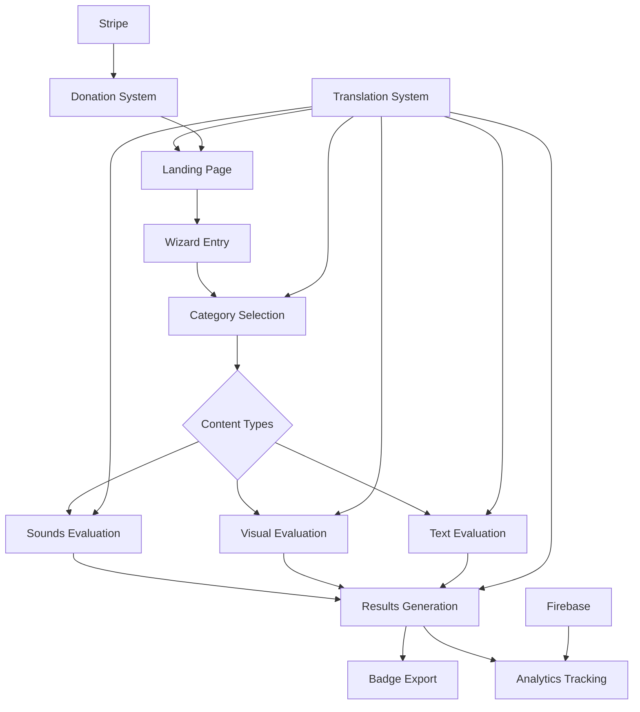
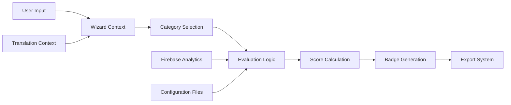
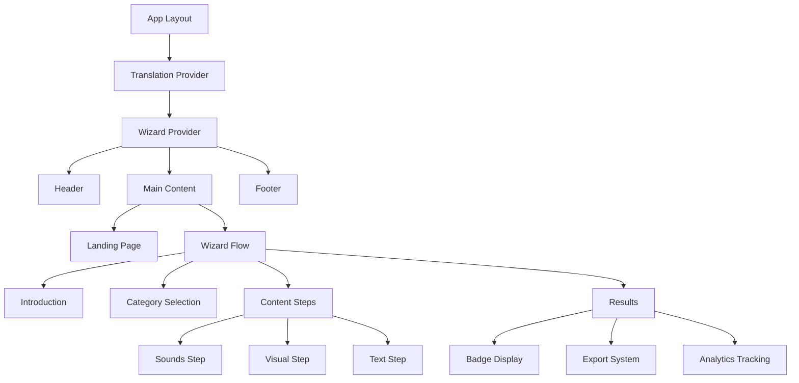

# Badge AI Architecture

## Overview

Badge AI is a Next.js 14 application that provides transparency in AI usage for creative works. The system enables creators to evaluate and communicate their level of AI involvement across three content types: sounds/music, visual content, and text. The application generates standardized badges using a 5-level classification system (0-4) with notation formats like `S-AI-2`, `V-AI-0`, `T-AI-4`.

## Key Benefits and Capabilities

- **Transparent AI Usage Communication**: Standardized badge system for creative transparency
- **Multi-Content Type Support**: Separate evaluation for sounds, visual, and text content
- **Dual Evaluation Modes**: Manual category selection or questionnaire-based assessment
- **Professional Badge Generation**: SVG badges with multiple export formats
- **International Support**: French/English localization with next-intl
- **Analytics Integration**: Anonymous usage tracking via Firebase and Vercel Analytics

## High-Level Architecture



## System Architecture

### Core Components Overview

The application is built on a component-based architecture with clear separation of concerns:

**Presentation Layer:**
- React components with Tailwind CSS styling
- Framer Motion animations for enhanced UX
- Responsive design with mobile-first approach

**State Management:**
- React Context for wizard state and internationalization
- Local component state for UI interactions
- Firebase for persistence and analytics

**Data Layer:**
- Configuration-driven questionnaire system
- JSON-based translation management
- SVG asset pipeline for badge generation

**Integration Layer:**
- Firebase Realtime Database for analytics
- Stripe API for donation processing
- Vercel Analytics for performance monitoring

### Data Flow Architecture



The system follows a unidirectional data flow where user interactions update the WizardContext, which drives the evaluation logic and badge generation process.

### Component Relationship Structure



## Implementation Details

### Technology Stack

**Frontend Framework:**
- Next.js 14 with App Router for modern React patterns
- TypeScript for type safety and developer experience
- Tailwind CSS with custom design system

**State Management:**
- React Context API for global state
- Custom hooks for wizard navigation and translation

**Styling System:**
- Custom color palette: `primary-*`, `accent-*`, `surface-*`, `text-*`
- Glass morphism design with backdrop blur effects
- Responsive breakpoints with mobile-first approach

**Animation Framework:**
- Framer Motion for smooth transitions and micro-interactions
- Page transitions and component animations
- Hover effects and state change animations

### Configuration Architecture

The system uses configuration-driven patterns for maintainability:

**Translation Configuration:**
```typescript
// src/translations/en.ts
export const translations = {
  category0Title: "Human Only",
  category0Description: "Exclusively human-created content...",
  // ... dynamic translation keys
};
```

**Questionnaire Configuration:**
```typescript
// src/types/index.ts
export const musicQuestions: QuestionItem[] = [
  {
    id: "q1",
    text: "How was the musical material created?",
    options: [
      { id: "a", text: "Entirely AI generated", points: 4 },
      // ... scoring options
    ]
  }
];
```

**Badge System Configuration:**
```typescript
// SVG badges located in public/badges/category-[0-4].svg
// Dynamic badge generation with standardized notation
const badgeCode = `${type}-AI-${level}`; // S-AI-2, V-AI-0, T-AI-4
```

### Integration Patterns

**Firebase Integration:**
```typescript
// src/lib/firebase-config.ts
const firebaseConfig = {
  apiKey: process.env.NEXT_PUBLIC_FIREBASE_API_KEY,
  // ... environment-based configuration
};

// Analytics tracking
trackEvent('badge_generated', {
  contentTypes: selectedCategories,
  categories: finalResults
});
```

**Stripe Integration:**
```typescript
// src/app/api/create-donation-session/route.ts
export async function POST(request: Request) {
  const session = await stripe.checkout.sessions.create({
    // ... donation session configuration
  });
}
```

## API Documentation

### Core Functions and Usage

**Wizard Navigation:**
```typescript
// src/contexts/WizardContext.tsx
interface WizardContextType {
  step: number;
  setStep: (step: number) => void;
  selectedCategories: SelectedCategories;
  soundsCategory: Category;
  // ... wizard state management
}

// Usage in components
const { step, setStep, soundsCategory } = useWizard();
```

**Category Calculation:**
```typescript
// src/types/index.ts
export const calculateCategory = (
  answers: Record<string, number>,
  weights: Record<string, number>
): Category => {
  // Weighted scoring algorithm
  const score = totalPoints / totalWeight;
  if (score >= 3.5) return 4; // Human-dominant
  if (score >= 0.5) return 1; // AI-dominant
  return 0; // Full AI
};
```

**Badge Generation:**
```typescript
// src/steps/Result.tsx
const generateBadgeHtml = () => {
  return `<div style="display: inline-flex; gap: 8px;">
    ${selectedBadges.map(badge => 
      `<span style="...">${badge.title}: ${badge.code}</span>`
    ).join('')}
  </div>`;
};

const generateMarkdownCode = () => {
  return selectedBadges.map(badge =>
    `}-blue)`
  ).join('\n');
};
```

**Translation System:**
```typescript
// src/contexts/TranslationContext.tsx
export const useTranslation = () => {
  const { language, translations } = useContext(TranslationContext);
  
  const t = (key: string): string => {
    return translations[key] || key;
  };
  
  return { t, language, setLanguage };
};
```

### Integration Examples

**Component Integration:**
```typescript
// Wizard step component pattern
interface StepProps {
  onNext?: () => void;
  onBack?: () => void;
}

export default function SoundsStep({ onNext, onBack }: StepProps) {
  const { soundsCategory, setSoundsCategory } = useWizard();
  const { t } = useTranslation();
  
  return (
    <div className="space-y-6">
      {soundsCategoryOptions.map(option => (
        <CategoryCard
          key={option.id}
          selected={soundsCategory === option.id}
          onClick={() => setSoundsCategory(option.id)}
          title={t(option.titleKey)}
          description={t(option.descriptionKey)}
        />
      ))}
    </div>
  );
}
```

**Analytics Integration:**
```typescript
// src/lib/enhanced-analytics.ts
export const trackBadgeGeneration = (data: {
  contentTypes: string[];
  categories: Record<string, number>;
  exportFormat: string;
}) => {
  // Firebase analytics tracking
  push(ref(db, 'events'), {
    type: 'badge_generated',
    timestamp: Date.now(),
    data
  });
};
```

## Developer Guide

### Adding New Content Types

1. **Update Type Definitions:**
```typescript
// src/types/index.ts
export type ContentType = "sounds" | "visual" | "text" | "newType";

export interface SelectedCategories {
  sounds: boolean;
  visual: boolean;
  text: boolean;
  newType: boolean;
}
```

2. **Create Evaluation Component:**
```typescript
// src/steps/NewTypeStep.tsx
export default function NewTypeStep({ onNext, onBack }: StepProps) {
  const { newTypeCategory, setNewTypeCategory } = useWizard();
  // ... implementation
}
```

3. **Add Translation Keys:**
```typescript
// src/translations/en.ts
export const translations = {
  // ... existing keys
  newTypeTitle: "New Content Type",
  newTypeDescription: "Evaluation criteria for new type",
};
```

### Extending Questionnaire System

**Add New Questions:**
```typescript
// src/types/index.ts
export const newTypeQuestions: QuestionItem[] = [
  {
    id: "q1",
    text: "How was the content created?",
    options: [
      { id: "a", text: "Fully AI generated", points: 1 },
      { id: "e", text: "Fully human created", points: 5 }
    ]
  }
];

export const newTypeWeights: Record<string, number> = {
  q1: 1.5, // Higher weight for critical questions
};
```

### Badge System Extensions

**Custom Badge Designs:**
1. Create SVG files in `public/badges/newtype-category-[0-4].svg`
2. Update badge generation logic in `src/steps/Result.tsx`
3. Add new badge notation format (e.g., `N-AI-2`)

**New Export Formats:**
```typescript
// src/steps/Result.tsx
const generateCustomFormat = () => {
  return selectedBadges.map(badge => ({
    notation: badge.code,
    description: badge.description,
    level: badge.category,
    timestamp: new Date().toISOString()
  }));
};
```

### Testing Approaches

**Component Testing:**
```typescript
// Test wizard navigation
const { result } = renderHook(() => useWizard(), {
  wrapper: WizardProvider
});

act(() => {
  result.current.setStep(2);
});

expect(result.current.step).toBe(2);
```

**Integration Testing:**
```typescript
// Test badge generation workflow
render(
  <WizardProvider>
    <Result />
  </WizardProvider>
);

// Simulate category selection and verify badge output
```

The Badge AI architecture provides a robust foundation for transparent AI usage communication in creative works, with clear extension points for adding new content types, evaluation methods, and export formats.