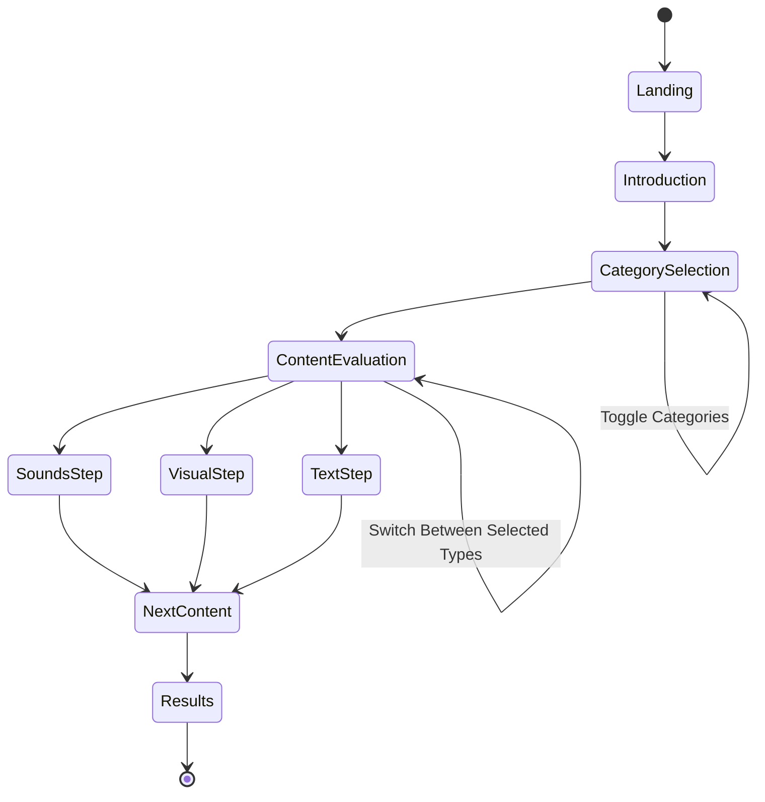
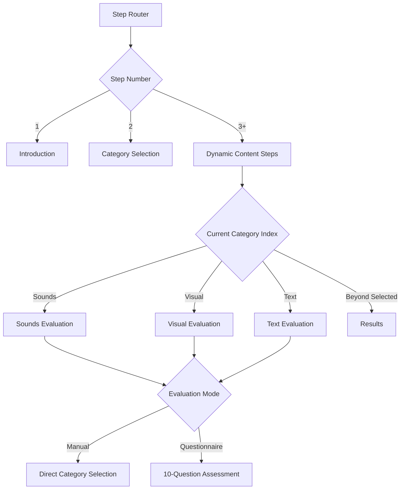
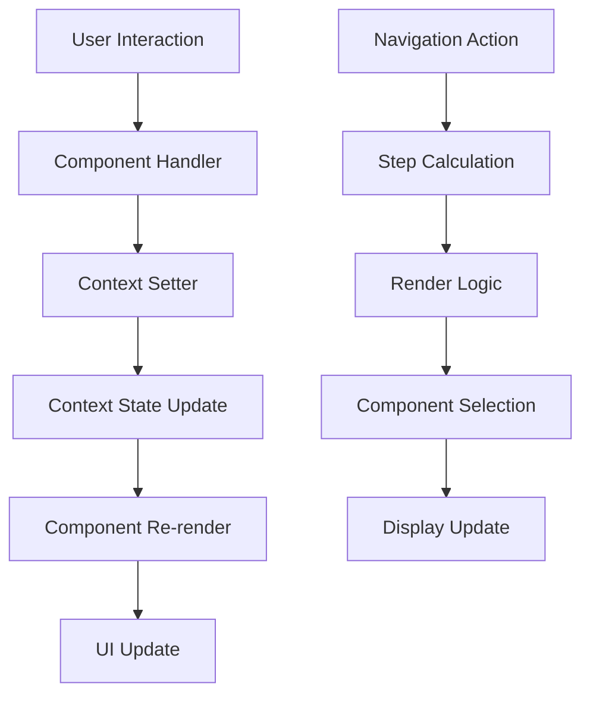

# Wizard System and State Management

## Overview

The Badge AI wizard system manages a multi-step evaluation process that guides users through AI usage assessment across different content types. The system uses React Context for state management and provides a flexible framework for step navigation, category selection, and evaluation tracking.

## Wizard Architecture



## State Management Architecture

### Core Context Structure

The wizard system uses two primary React Contexts:

```typescript
// src/contexts/WizardContext.tsx
interface WizardContextType {
  // Navigation state
  step: number;
  setStep: (step: number) => void;
  
  // Category selection state
  selectedCategories: SelectedCategories;
  setSelectedCategories: (categories: SelectedCategories) => void;
  
  // Evaluation results
  soundsCategory: Category;
  setSoundsCategory: (category: Category) => void;
  visualCategory: Category;
  setVisualCategory: (category: Category) => void;
  textCategory: Category;
  setTextCategory: (category: Category) => void;
  
  // Evaluation mode
  isQuestionnaireMode: boolean;
  setQuestionnaireMode: (mode: boolean) => void;
  
  // Questionnaire responses
  soundsQuestionnaireAnswers: Record<string, number>;
  setSoundsQuestionnaireAnswers: (answers: Record<string, number>) => void;
  visualQuestionnaireAnswers: Record<string, number>;
  setVisualQuestionnaireAnswers: (answers: Record<string, number>) => void;
  textQuestionnaireAnswers: Record<string, number>;
  setTextQuestionnaireAnswers: (answers: Record<string, number>) => void;
}
```

### Translation Context

```typescript
// src/contexts/TranslationContext.tsx
interface TranslationContextType {
  language: string;
  setLanguage: (lang: string) => void;
  translations: Record<string, string>;
  t: (key: string) => string;
}
```

## Step Navigation System

### Step Calculation Logic

The wizard implements dynamic step calculation based on selected content types:

```typescript
// src/app/page.tsx (lines 53-55)
const totalSteps = 1 + Object.values(selectedCategories).filter(Boolean).length + 1;
// Category Selection + Selected Categories + Result

// Step progression logic
const canContinue = () => {
  switch (step) {
    case 1: return true; // Introduction
    case 2: return Object.values(selectedCategories).some(Boolean); // At least one category
    default:
      const currentStepIndex = step - 3;
      const categories = Object.entries(selectedCategories)
        .filter(([_, selected]) => selected)
        .map(([category]) => category);
      
      if (currentStepIndex >= 0 && currentStepIndex < categories.length) {
        const currentCategory = categories[currentStepIndex];
        switch (currentCategory) {
          case "sounds": return soundsCategory !== null;
          case "visual": return visualCategory !== null;
          case "text": return textCategory !== null;
        }
      }
      
      return currentStepIndex >= categories.length;
  }
};
```

### Step Rendering Logic



The step rendering uses a switch statement that dynamically maps steps to content types:

```typescript
// src/app/page.tsx (lines 127-165)
const renderStep = () => {
  switch (step) {
    case 1: return <Introduction onNext={handleNext} />;
    case 2: return <ManualSelectionStep onNext={handleNext} onBack={handleBack} />;
    default:
      const currentStepIndex = step - 3;
      const categories = Object.entries(selectedCategories)
        .filter(([_, selected]) => selected)
        .map(([category]) => category);

      if (currentStepIndex >= categories.length) {
        return <Result onBack={handleBack} />;
      }

      const currentCategory = categories[currentStepIndex];
      switch (currentCategory) {
        case "sounds":
          return isQuestionnaireMode 
            ? <SoundsQuestionnaire onNext={handleNext} onBack={handleBack} />
            : <SoundsStep onNext={handleNext} onBack={handleBack} />;
        // ... similar for visual and text
      }
  }
};
```

## Category Selection System

### Selection State Management

Categories are managed through a boolean selection state:

```typescript
// Initial state in WizardContext
const [selectedCategories, setSelectedCategories] = useState<SelectedCategories>({
  sounds: false,
  visual: false,
  text: false,
});
```

### Category Toggle Implementation

```typescript
// src/steps/ManualSelectionStep.tsx
const toggleCategory = (category: keyof SelectedCategories) => {
  setSelectedCategories(prev => ({
    ...prev,
    [category]: !prev[category]
  }));
};
```

### Visual Category Cards

Each content type is represented by an interactive card component:

```typescript
// Category card pattern used in ManualSelectionStep
<motion.button
  onClick={() => toggleCategory('sounds')}
  className={`p-6 rounded-2xl border transition-all ${
    selectedCategories.sounds 
      ? 'border-primary-500 bg-primary-500/20' 
      : 'border-white/10 bg-surface-card/40'
  }`}
>
  <div className="flex items-center justify-between">
    <div className="flex items-center space-x-4">
      <Image src="/icons/sounds-icon.svg" alt="Sounds" />
      <div>
        <h3>{t('soundsCategoryTitle')}</h3>
        <p>{t('soundsCategoryDescription')}</p>
      </div>
    </div>
    <CheckCircleIcon className={`w-6 h-6 ${
      selectedCategories.sounds ? 'text-primary-400' : 'text-transparent'
    }`} />
  </div>
</motion.button>
```

## Evaluation Modes

### Manual Selection Mode

Direct category selection using predefined options:

```typescript
// src/steps/SoundsStep.tsx
export default function SoundsStep({ onNext, onBack }: StepProps) {
  const { soundsCategory, setSoundsCategory } = useWizard();
  const { t } = useTranslation();

  return (
    <div className="space-y-6">
      {soundsCategoryOptions.map(option => (
        <motion.button
          key={option.id}
          onClick={() => setSoundsCategory(option.id)}
          className={`category-card ${soundsCategory === option.id ? 'selected' : ''}`}
        >
          <div className="flex items-center space-x-6">
            <Image src={`/badges/category-${option.id}.svg`} />
            <div>
              <h3>{t(option.titleKey)}</h3>
              <p>{t(option.descriptionKey)}</p>
            </div>
          </div>
        </motion.button>
      ))}
    </div>
  );
}
```

### Questionnaire Mode (Partially Implemented)

The system includes a sophisticated questionnaire framework that is currently simplified in the UI:

```typescript
// Current implementation in questionnaire components
const [currentQuestion, setCurrentQuestion] = useState(0);
const [answers, setAnswers] = useState<Record<string, number>>({});

const handleAnswer = (questionId: string, points: number) => {
  const newAnswers = { ...answers, [questionId]: points };
  setAnswers(newAnswers);
  
  // Simple averaging (not using the sophisticated weighted algorithm)
  const totalPoints = Object.values(newAnswers).reduce((sum, p) => sum + p, 0);
  const averagePoints = totalPoints / Object.keys(newAnswers).length;
  const category = Math.round(averagePoints) as Category;
  
  setSoundsCategory(category);
};
```

## Progress Tracking

### Progress Bar Component

The system includes a sophisticated progress tracking component:

```typescript
// src/components/ProgressBar.tsx
interface ProgressBarProps {
  currentStep: number;
  totalSteps: number;
  onBack: () => void;
  onNext: () => void;
  canContinue: boolean;
  isQuestionnaireMode: boolean;
  currentQuestion: number;
  totalQuestions: number;
}
```

The progress bar adapts to show either step progress or question progress:

```typescript
// Progress calculation
const progressPercentage = isQuestionnaireMode
  ? (currentQuestion / totalQuestions) * 100
  : (currentStep / totalSteps) * 100;
```

## Data Flow Patterns

### Unidirectional Data Flow



### State Persistence Strategy

The wizard state is maintained in memory during the session:

- **No automatic persistence**: State resets on page refresh
- **Context-based storage**: All state lives in React Context
- **Session-scoped**: No cross-session data retention
- **Analytics tracking**: Final results are tracked for analytics

### Error Handling and Validation

```typescript
// Validation patterns used throughout the wizard
const canContinue = () => {
  // Step-specific validation logic
  // Ensures required selections are made before progression
};

// Error boundary pattern for wizard steps
export const useWizard = (): WizardContextType => {
  const context = useContext(WizardContext);
  
  if (!context) {
    throw new Error("useWizard must be used within a WizardProvider");
  }
  
  return context;
};
```

## Integration Points

### Analytics Integration

```typescript
// State changes trigger analytics events
useEffect(() => {
  if (step > 1) {
    trackEvent('wizard_step_completed', { step, selectedCategories });
  }
}, [step]);
```

### Translation Integration

```typescript
// All user-facing text uses translation keys
const { t } = useTranslation();
return <h1>{t('categorySelectionTitle')}</h1>;
```

### Animation Integration

```typescript
// Framer Motion animations tied to state changes
<AnimatePresence mode="wait">
  <motion.div
    key={step}
    initial={{ opacity: 0, x: 20 }}
    animate={{ opacity: 1, x: 0 }}
    exit={{ opacity: 0, x: -20 }}
  >
    {renderStep()}
  </motion.div>
</AnimatePresence>
```

The wizard system provides a robust foundation for guided user interactions while maintaining clean separation between navigation logic, content evaluation, and state management.